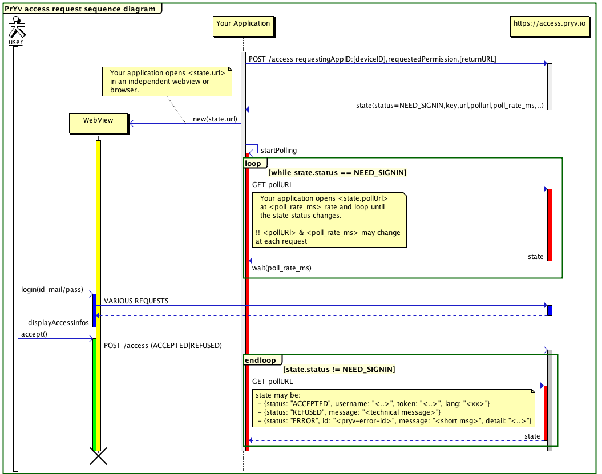

# Introduction

Get an access token.

## <a id="intro-initial-requirements"></a>Initial requirements

### 1. Get a Pryv app id for your app

A Pryv app id is a string uniquely identifying your app. For the moment, just [ask us](mailto:developers@pryv.com) to obtain your app id.

### 2. Define the access permissions you need

See the examples below, as well as the `permissions` property in the [access data structure reference](reference/#data-structure-access).

#### Example app permissions

A "contribute" access on the "diary" stream:

```json
[{
  "streamId" : "diary",
  "defaultName" : "Journal",
  "level" : "contribute"
}]
```

A "manage" access to the "notes" and "mood" folders of the "diary" channel:

```json
[{
   "streamId" : "diary",
   "defaultName" : "Journal",
   "level" : "read",
  },
  {
   "streamId" : "notes",
   "level" : "manage",
   "defaultName" : "Notes"
   },
   {
    "streamId" : "mood",
    "level" : "manage",
    "defaultName" : "Mood"
   }
}]
```

**About the `defaultName` property**: `defaultName` is the name you'd like the stream to be created with if it does not exist, and should be in the language of the user. The property is mandatory.


# Web app (Javascript)

Obtaining an access token for your web app.


## What you need

* make sure you got the [initial requirements](#intro-initial-requirements) ready.
* include the following script in your page:
	- From github:
	```html
	<script type="text/javascript" src="//pryv.github.io/lib-javascript/latest/pryv.js"></script>
	```
	- or the optimized CloudFront cache: (recommended)
	```html
	<script type="text/javascript" src="//dlw0lofo79is5.cloudfront.net/lib-javascript/latest/pryv.js"></script>
	```
* construct a `settings` JSON object
* call `Pryv.Auth.setup(settings)`

For a more fleshed-out example look at the source code of [http://codepen.io/pryv/pen/apQJxz](http://codepen.io/pryv/pen/apQJxz).

<a name="webapp.test"></a>Or make your own tests from the page:
[https://sw.pryv.li:2443/access/test.html](https://sw.pryv.li:2443/access/test.html)


### Example: Minimalistic

This app requests a "contribute" access to the "diary" stream, using the PrYv button and a popup for sign-in.

**TODO: review this code**

```

	<!DOCTYPE html>
	<html>
	<head>
	<title>Minimalistic example</title>
	<script type="text/javascript" src="//d3gblc8a9weyfb.cloudfront.net/access/v1/pryv-sdk.js"></script>
	</head>
	<body>
		<script type="text/javascript">

		function callMeWithCredentials(username, appToken, languageCode) {
			alert("SUCCESS! username:" + username + " appToken:" +
					appToken + " language:" + languageCode);
		}

		var requestedPermissions = [{"streamId" : "diary",
									"defaultName" : "Diary", // this name is localized
	                                     "level" : "contribute"}];

	    Pryv.Auth.setup({
	        requestingAppId : 'pryv-mini-example',
	        requestedPermissions : requestedPermissions,
	        returnURL: 'auto#',
	        spanButtonID : 'pryvButton',
	        callbacks : {
              initialization : function() { },
              needSignin : function(popupUrl, pollUrl, pollRateMs) { },
              accepted : function(username, appToken, languageCode) {
                console.log("** SUCCESS! username:" + username +
                            " appToken:" + appToken +
                            " lang:" + languageCode);
              },
              refused: function(reason) {
                 console.log("** REFUSED! " + reason);
              },
              error: function(code, message) {
                console.log("** ERROR! " + code + " " + message);
           }
	    });

	    </script>
		<span id='pryvButton'></span>
	</body>
	</html>

```

## Pryv.Auth.setup(settings)


The **settings** object supports the following parameters:

  - `requestingAppId` (string): Unique. Given by PrYv identifier for this app. It will be the key for the requested set of permission after user agreement.
  - `languageCode`(2 characters ISO 639-1 Code): Optional. If known the current language used by the user. This will influence the signin and register interface language.
  - `requestedPermissions` (object): The requested set of permissions to access user's streams.
  - `returnURL` (url or 'auto<extra>'): Optional. If you don't want (or can't have) the popup signin-process and prefer set a returnURL. This URL will be called at the en of the SIGNIN process.This provides a better user experience on mobile devices. Details: [settings.returnURL](#webapp.returnURL)
  - `spanButtonID` (string) Optional. The id of a `<span />` element in the DOM of your web page. Details: [settings.spanButtonID](#webapp.spanButtonID)
  - `callbacks` (functionS): called on each step of the sign-in process. Most of them are optional if you decided to rely on PrYv signin Button. All are optional excepted "accepted". Details: [settings.callbacks](#webapp.callbacks)
    - `initialization` (function()): When the initialization process is started. You may display a "loading" animation or for the user.
    - `needSignin` (function(popupUrl,pollUrl,pollRateMs)): Optional. Triggered when the user need to be redirected to PrYv Signin or register from.
    	- param `popupUrl` (string): The URL to open in it's own window and to present to the user.
    	- param `pollUrl` (string): The URL to poll regularly in the background to grab the result of the sigin process.
    	- param `pollRateMs` (int): The minimum interval in milliseconds between to polling.
    - `accepted` (function(username,appToken,languageCode)): **Mandatory**. Called when the signin process succeed and the permissions requested a granted. It's also triggered after a logout action with `(false,false,false)` as parameters.
    - `refused` (function(reason)): called when the user refuse to grant the requested permissions.
        - param `reason`(string): Technical information on how the user refused (not to be displayed).
    - `error` (function(pryvError)): called when an error interupting the signup process occured.
        - param `pryvError` (object): `{id: .., message: .., detail: ..}`


### <a name="webapp.returnURL"></a> settings.returnURL : Popup or URL Callback


During the authentication process, we need to open a PrYv access web page in a separate window. This is in order to secure personal user's information.

This window can be opened in:

 - A popup, leaving the actual window open behind. This should be more comfortable on desktop browsers.
 - In place of the actual window, the user goes thru the process and come back to the URL you set at the end of the process.

#### * Popup

If you want the authorization process to take place in a popup just set the `returnURL` settings to `false`.

#### * Self or Auto

If you want the authorization process to take place in the same windows, returning to this same exact url you can use `self[extra_params]<trailer>` or `auto[extra_params]<trailer>`.

When the user returns to this same page, the pryv-access-sdk will parse `prYv` parameters.

* command
  - **self**: Use the current page as returnURL value
  - **auto**: (prefered method) Use a returnURL when a mobile or tablet browser is detected and a popupOtherwise
* parameters
  - **&lt;trailer>**: one of `?`, a `#` or a `&`
  - **[extra_parms]**: Use this space (uri_encoded) as a custom payload for the returning user.

EXAMPLES

* with `https://mysite.com/page.php` as source URL.
  - **self#** -> `https://mysite.com/page.php#prYvkey=JDJKhadja&prYvstatus=...`
  - **self?** -> `https://mysite.com/page.php?prYvkey=JDJKhadja&prYvstatus=...`
  - **self?mycustom=A&** -> `https://mysite.com/page.php?mycustom=A&prYvkey=JDJKh...`
  - **auto?mobile=1&** (if mobile) -> `https://mysite.com/page.php?mobile=1&prYvkey=JD...`

* with `https://mysite.com/page.php?mycustom=1` as source URL.
  - **self&** -> `https://mysite.com/page.php?mycustom=1&prYvk...`

Make your own tests from the [test page](#webapp.test).

#### * Custom

Set the return URL to your own page such as

	https://www.mysite.com/end-of-Pryv.Access-process.php?

**Attention!!** The url submitted *must* end with a `?`, a `#` or a `&`
Returned status will be appended to this URL.

#### Examples of return URL

ACCEPTED

		https://www.mysite.com/end-of-Pryv.Access-process.php?
	prYvkey=GSbdasjgdv&prYvstatus=ACCEPTED&prYvusername=yacinthe&prYvtoken=VVhjDJDDG

REFUSED

		https://www.mysite.com/end-of-Pryv.Access-process.php?
	prYvkey=GSbdasjgdv&prYvstatus=REFUSED&prYvmessage=refused+by+user

ERROR

		https://www.mysite.com/end-of-Pryv.Access-process.php?
	prYvkey=GSbdasjgdv&prYvstatus=ERROR&prYvid=INTERNAL_ERROR&prYvmessage=...

### <a name="webapp.spanButtonID"></a> settings.spanButtonID : Rely on PrYv standard Button
TODO

### <a name="webapp.callbacks"></a> settings.callbacks Custom handling of the signin process
TODO

## Pryv.Access.popupLogin()
Once setup is done, you can trigger the populLogin window from your own button.
Note: Trigger it from a user-click event.

## Pryv.Access.logout()
Once setup is done, and user logged in. Erase current credential and restart setup with the same settings.

**logout()** will trigger a `settings.callbacks.success(false,false,false);`

## Pryv.Access.retry()
If a user refused to grant access, restart the setup process with the same settings.

## Other Examples


### Full


---
order: 3
---

# Custom

Implementing the authorization process and obtaining an access token all by yourself.

**For testing: **
Use our staging servers: https://access.pryv.in/access


**Steps: **

1. start an access request by calling **POST https://access.pryv.io/access**
2. open **response.url**  in a webview
3. poll **response.pollurl** until you get the an ACCEPTED / REFUSED or ERROR status

## Sequence diagram



## Json Examples
You can reporoduce this examples and try other combinations
from [https://sw.pryv.li/access/test.html](https://sw.pryv.li/access/test.html)


### Access request

**request**: `POST https://reg.pryv.in/access`
**payload**:

```
{
  "requestingAppId": "web-page-test",
  "requestedPermissions": [
    {
      "streamId": "diary",
      "defaultName": "Journal",
      "level": "read",
    },
    {
      "streamId": "notes",
      "level": "manage",
      "defaultName": "Notes"
    },
    {
      "streamId": "position",
      "defaultName": "Position",
      "level": "read"
    },
    {
      "streamId": "iphone",
      "level": "manage",
      "defaultName": "iPhone"
     }
  ],
  "languageCode": "en",
  "returnURL": false
}
```


**response**:

```
{
  "status": "NEED_SIGNIN",
  "code": 201,
  "key": "dXRqBezem8v3mNxf",
  "requestingAppId": "web-page-test",
  "requestedPermissions": [
    {
     "streamId": "diary",
     "defaultName": "Journal",
     "level": "read",
    },
    {
     "streamId": "notes",
     "level": "manage",
     "defaultName": "Notes"
     }
    },
    {
     "streamId": "position",
     "defaultName": "Position",
     "level": "read"
    }
  ],
  "url": "https://sw.pryv.in:2443/access/v1/access.html?lang=en&key=dXRqBezem8v3mNxf&requestingAppId=web-page-test&returnURL=false&domain=pryv.in&registerURL=https%3A%2F%2Freg.pryv.in%3A443&requestedPermissions=%5B%7B%22streamId%22%3A%22diary%22%2C%22defaultName%22%3A%22Journal%22%2C%22level%22%3A%22read%22%2C%22folderPermissions%22%3A%5B%7B%22streamId%22%3A%22notes%22%2C%22level%22%3A%22manage%22%2C%22defaultName%22%3A%22Notes%22%7D%5D%7D%2C%7B%22streamId%22%3A%22position%22%2C%22defaultName%22%3A%22Position%22%2C%22level%22%3A%22read%22%2C%22folderPermissions%22%3A%5B%7B%22streamId%22%3A%22iphone%22%2C%22level%22%3A%22manage%22%2C%22defaultName%22%3A%22iPhone%22%7D%5D%7D%5D",
  "poll": "https://reg.pryv.in:443/access/dXRqBezem8v3mNxf",
  "returnURL": false,
  "poll_rate_ms": 1000
}
```


### Polling

**request**: GET `https://reg.pryv.in/access/dXRqBezem8v3mNxf`

3 response codes:

**1 response**: `NEED_SIGNIN`

Content is the same than for the initial POST request.
**poll** and **poll_rate_ms** may vary

**2 response**: 200 `ACCEPTED`

```
{
  "status": "ACCEPTED",
  "username": "jondoe",
  "token": "VTR7DOKN1J",
  "code": 200
}
```

**3 response**: 403 `REFUSED`

```
{
  "status": "REFUSED",
  "reasonID": "REFUSED_BY_USER",
  "message": "access refused by user",
  "code": 403
}
```


